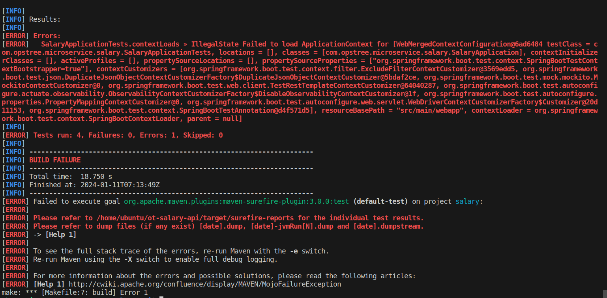
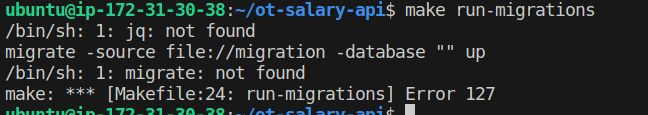

Port 7199
here used 9042

create keyspace, table  
edit src/main/resources/application.yml
edit test/main/resources/application.yml
edit migration.json


java -jar target/salary-0.1.0-RELEASE.jar


## Salary API 
# Prequisites  
  # Installed required s/w 

sudo apt update 
sudo apt install openjdk-17-jre-headless -y
sudo apt install maven -y

  # install scylladb
https://opensource.docs.scylladb.com/stable/getting-started/install-scylla/install-on-linux.html
scylladb : seeds ,rpc, listen addreess
sudo scylla_setup'

  # Redis
sudo apt install redis-server


#### Now to Setup up API

1. to run MAKE
    ```shell
     sudo apt install make -y 
    ```
 
2. ```shell
    make build
    ```
  [Error -01]

  

3. to check dependencies required for mvn 
  - https://medium.com/@mlvandijk/keeping-dependencies-up-to-date-with-maven-be8f7fb6441e#:~:text=Using%20Maven%20to%20display%20dependency%20updates&text=Run%20the%20following%20command%20in%20your%20terminal%3A%20.%2Fmvnw%20versions,newer%20versions%20have%20been%20found.&text=As%20you%20can%20see%2C%20there,be%20updated%20in%20this%20project.
    ```shell
    mvn dependency:copy-dependencies 
    ```

4. ```shell
    make run-migrations
    ```
  [ERROR- 02]
  

5. install jq and migrate
  JQ
  ```shell
  sudo apt install jq -y 
    ```
  Migrate
  ```shell
  curl -s https://packagecloud.io/install/repositories/golang-migrate/migrate/script.deb.sh | sudo bash
  sudo apt update
  sudo apt install migrate -y  
  ```

##### create keyspace
cqlsh 

CREATE KEYSPACE IF NOT EXISTS employee_db
  WITH replication = {'class': 'SimpleStrategy', 'replication_factor': 1};
  
git clone https://github.com/OT-MICROSERVICES/salary-api.git
sudo apt install make  -y
make build 
make fmt
make run-migrations
  
#### install migrate
  
test $(go list ./... | grep -v docs | grep -v model | grep -v main.go) -coverprofile cover.out
go tool cover -html=cover.out

export GIN_MODE=release
For debugging set gin mode to development
./employee-api
 git clone https://github.com/OT-MICROSERVICES/employee-api.git
 
 change config.yaml ,migration.json
 

 
 http://3.79.243.190:8080/swagger/doc.json
 
 #################

 
 sudo apt install python3-poetry