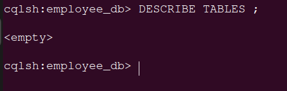
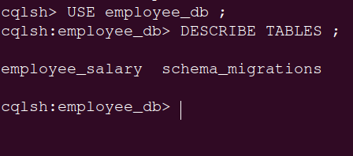
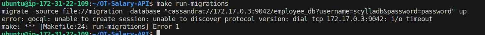
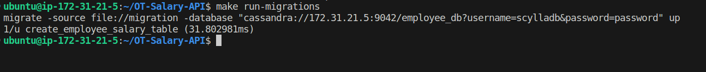
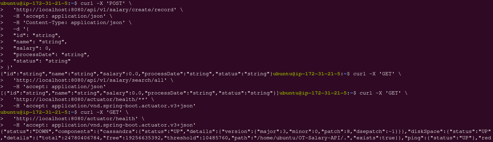

Port 7199
here used 9042

create keyspace, table  
edit src/main/resources/application.yml
edit test/main/resources/application.yml
edit migration.json


java -jar target/salary-0.1.0-RELEASE.jar


## Salary API 
# Prequisites  
  # Installed required s/w 

sudo apt update 
sudo apt install openjdk-17-jre-headless -y
sudo apt install maven -y

  # install scylladb
https://opensource.docs.scylladb.com/stable/getting-started/install-scylla/install-on-linux.html
scylladb : seeds ,rpc, listen addreess
sudo scylla_setup'

  # Redis
sudo apt install redis-server


#### Now to Setup up API

1. to run MAKE
    ```shell
     sudo apt install make -y 
    ```
 
2. ```shell
    make build
    ```
  [Error -01]

  

3. to check dependencies required for mvn 
4. https://mvnrepository.com/artifact/io.springfox/springfox-swagger2/3.0.0 
  - https://medium.com/@mlvandijk/keeping-dependencies-up-to-date-with-maven-be8f7fb6441e#:~:text=Using%20Maven%20to%20display%20dependency%20updates&text=Run%20the%20following%20command%20in%20your%20terminal%3A%20.%2Fmvnw%20versions,newer%20versions%20have%20been%20found.&text=As%20you%20can%20see%2C%20there,be%20updated%20in%20this%20project.
    ```shell
    mvn dependency:copy-dependencies 
    ```

5. ```shell
    make run-migrations
    ```
  [ERROR- 02]
  

1. install jq
    ```shell
    sudo apt install jq -y 
      ```

2. install Migrate
    ```shell
      curl -s https://packagecloud.io/install/repositories/golang-migrate/migrate/script.deb.sh | sudo bash
      sudo apt update
      sudo apt install migrate -y  
    ```

##### create keyspace
cqlsh 





git clone https://github.com/OT-MICROSERVICES/salary-api.git
sudo apt install make  -y
make build 
make fmt
make run-migrations
  
#### install migrate


java -jar target/salary-0.1.0-RELEASE.jar

http://18.153.79.146:8080/swagger-ui/ 

http://3.66.17.246:8080/salary-documentation

test $(go list ./... | grep -v docs | grep -v model | grep -v main.go) -coverprofile cover.out
go tool cover -html=cover.out

export GIN_MODE=release
For debugging set gin mode to development
./employee-api
 git clone https://github.com/OT-MICROSERVICES/employee-api.git
 
 change config.yaml ,migration.json
 
import org.springframework.web.servlet.config.annotation.CorsRegistry;

 
 http://3.79.243.190:8080/swagger/doc.json
 
 #################

 
 sudo apt install python3-poetry

 <dependency>
    <groupId>io.springfox</groupId>
    <artifactId>springfox-swagger2</artifactId>
    <version>2.9.2</version>
</dependency>

<dependency>
    <groupId>io.springfox</groupId>
    <artifactId>springfox-swagger-ui</artifactId>
    <version>2.9.2</version>
</dependency>

import springfox.documentation.builders.PathSelectors;
import springfox.documentation.builders.RequestHandlerSelectors;
import springfox.documentation.spi.DocumentationType;
import springfox.documentation.spring.web.plugins.Docket;
import springfox.documentation.swagger2.annotations.EnableSwagger2;

@Configuration
@EnableSwagger2
public class SwaggerConfig {

    @Bean
    public Docket api() {
        return new Docket(DocumentationType.SWAGGER_2)
                .select()
                .apis(RequestHandlerSelectors.any())
                .paths(PathSelectors.any())
                .build();
    }
}

import org.springframework.web.bind.annotation.CrossOrigin;
    @CrossOrigin(origins = "http://172.31.22.109:8080") 


#### src/test/java/com/opstree/microservice/salary/SalaryApplicationTests.java

package com.opstree.microservice.salary;

import org.junit.jupiter.api.Test;
import static org.junit.jupiter.api.Assertions.assertEquals;

class SalaryApplicationTests {

	@Test
	void contextLoads() {
		final String name = "Deepak";
		assertEquals(name, "Deepak");
	}

}

#### Withhout config change error 




#### POST
{
  "id": "123",
  "name": "John Doe",
  "salary": 5000.0f,
  "processDate": "2023-07-17,
  "status": "Active"
}

####  Sucessful make run-migrations



#### Success 
#### 